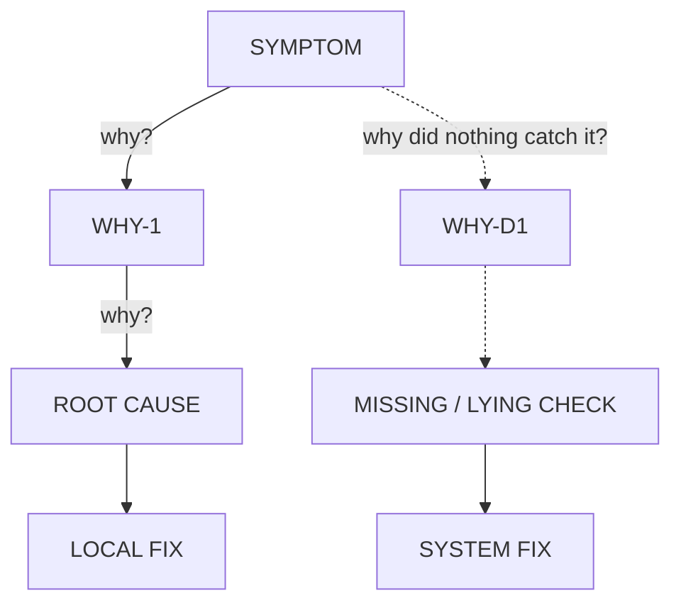

# Root Cause Analysis - Five Whys with Rival Agents

<objective>
Descend from an observed symptom through a chain of "why" links to the cause that,
once removed, makes the whole symptom CLASS impossible.

The deliverable is an artifact, not an opinion: a numbered chain in which every
link carries evidence, every link has survived an agent whose job was to destroy
it, and the final link has been proved by a flip test.
</objective>

<the_iron_law>
```
A LINK WITHOUT A FILLED EVIDENCE SLOT IS NOT A LINK.
A CHAIN CONTAINING ONE IS NOT AN ANALYSIS.
```

This holds when the answer looks obvious, when the chain is two links long, and
when you already know the answer before you start. The slots are filled anyway -
an analysis nobody can check is indistinguishable from a guess that happened to
be right.
</the_iron_law>

<evidence_contract>
Each WHY link carries exactly one EVIDENCE slot, filled in one of two forms:

- **CODE** - `path/to/file.ext:LINE`, plus the quoted lines that establish the claim.
- **EXPERIMENT** - the exact command, and its pasted output.

Nothing else is evidence.

| Source | Status |
|---|---|
| Repository source and tests | **EVIDENCE** |
| Output of a command you actually ran | **EVIDENCE** |
| README, design docs, ADRs, incident write-ups | hypothesis only |
| Code comments, `FIXME`, `TODO`, commit messages | hypothesis only |
| Memory files, `.planning/`, notes, a prior session | hypothesis only |
| This conversation, including your own earlier conclusions | hypothesis only |
| Another agent's claim that carries no slot of its own | hypothesis only |

A hypothesis source tells you **where to look**. It never occupies an EVIDENCE
slot. When a document and the code disagree, the code wins, and the disagreement
is itself a finding worth reporting.

Measured on `tests/planted-bug-fixture`: fresh-context agents rejected a signed-off
incident document naming the wrong cause, 4 runs of 4, including under time pressure.
Agents do not need to be told to distrust docs - so this skill does not tell them to.
What all four omitted unprompted was the artifact: no numbered chain, no `file:line`
citations, no flip test, forward verification only. That is what the slots are for.
</evidence_contract>

<topology>
Investigation runs in **fresh contexts**, never in the orchestrator's. The
orchestrator carries session history, memory and its own hypotheses - exactly the
material the evidence contract excludes.

```
        BRIEF: symptom + repro + paths + constraints
                  (NO hypotheses, no suspects)
                          |
              +-----------+-----------+
              v                       v          parallel, fresh context
        INVESTIGATOR A          INVESTIGATOR B
        builds its own          builds its own
        why-chain               why-chain
              |                       |
              +--------- swap --------+
              v                       v
         SKEPTIC over B          SKEPTIC over A
         attacks every link      attacks every link
         (refutation needs its own EVIDENCE slot)
              |                       |
              +-----------+-----------+
                          v
                    ARBITER (you)
        chains agree  -> flip test -> report
        chains differ -> discriminating experiment -> report
```

**The brief carries no hypotheses.** Naming your suspect in the brief buys two
agents that confirm you. Symptom, reproduction command, relevant paths, and what
must not change - nothing else.

Prompts: `references/investigator-prompt.md`, `references/skeptic-prompt.md`.
</topology>

<depth_rule>
Five is Toyota's heuristic, not a quota. **Two descents run, not one.**

**The CAUSAL descent** - why is this so? Descend while this is still true:

> Removing this link would still leave the symptom CLASS possible.

Stop at the first link where removing it makes the class impossible. Stopping
earlier ships a fix that the next input regenerates.

**The DETECTION descent** - why did nothing catch it? This one does not stop at
the code. Toyota's worked example ends at *"there is no peer-review step in the
deployment process"*, not at *"the script lacked a stop condition"*: the last
link names something about **how the work is done**. Keep asking until the answer
is a missing or lying check - a test that cannot fail, a gate blind to this
output, a measurement nobody takes. That answer is always actionable, which is
what the old objection to going deeper ("why was the deadline tight") was really
about.

A chain with only the causal descent explains this instance. It does not explain
why the instance was allowed to ship, and a fix built from it alone is
regenerated by the next change.

**Both descents obey the evidence contract.** A detection link is proved, not
asserted: grep the suite and paste what it does and does not assert; mutate the
cause and show the gate staying green.

**Test the boundary with a sibling.** If the symptom is wrong output for input X,
ask what the chain predicts for input Y. A link that explains X but not Y is not
yet the root.
</depth_rule>

<the_fix_is_two_parts>
The causal descent buys the LOCAL FIX; the detection descent buys the SYSTEM FIX.
A report carrying only the first is incomplete:

- **LOCAL FIX** - the smallest change that removes the root cause.
- **SYSTEM FIX** - the check that would have gone RED before this shipped, and
  goes red again if the cause returns. Verified by re-injecting the cause and
  watching it fail, exactly as the flip test does.

"We will be more careful" is not a system fix. A system fix is executable.
</the_fix_is_two_parts>

<the_chain_is_a_diagram>
A chain is a graph: two descents from one symptom, verdicts on the nodes, two
fixes at the leaves. Prose flattens it and the reader reconstructs the shape by
hand. **The report presents the chain as a mermaid `flowchart`, and the evidence
as a list keyed to the node ids** - the diagram carries the SHAPE, the list
carries the `file:line` quotes and pasted output that a diagram cannot hold.



Solid edges are the causal descent, dashed the detection descent. Node colour
carries the rival verdict - green SURVIVES, amber WEAK, red REFUTED - and **a
refuted node stays in the diagram**, red: deleting it hides what was tried, which
is half the result.

Node text is the CLAIM, never a label. A diagram whose nodes ("the parser", "the
config") would fit any investigation is decoration, and decoration is what this
skill exists to prevent.

The same applies to the rival chains: draw A's root, B's root, the discriminating
experiment and the arbitrated root. Converged chains draw two arrows into one
node - do not delete the rival, and do not invent a disagreement to fill the
picture.
</the_chain_is_a_diagram>

<flip_test>
The final link is not established until the symptom has been made to appear and
disappear on command:

1. Apply the fix - symptom gone, full suite green.
2. **Re-inject the cause alone** - symptom returns.
3. Restore.

Forward verification alone is not a flip test, and it is what agents produce when
left to themselves. If the cause genuinely cannot be re-injected, the report says
`FLIP: not flippable because <reason>` in that slot - and that is a weaker result,
stated as such, never an omission.
</flip_test>

<isolation>
- **One workspace per agent.** Agents that build, run tests, or edit in a shared
  directory manufacture phantom passes and phantom failures. Give each a copy or a
  git worktree, or serialise the experiment phase.
- **Foreground commands only, with a timeout.** A subagent that backgrounds work
  and waits stalls and loses its output.
- **Mutating experiments are restore-verified.** After restoring a mutation, re-run
  the baseline and confirm it is green again before drawing any conclusion from the
  next run.
</isolation>

<process>
1. **Fix the symptom statement.** Exact observed output vs expected, plus the one
   command that reproduces it. No repro - say so and stop; there is nothing to bisect.
2. **Write the brief** - hypothesis-free. Prepare one isolated workspace per agent.
3. **Dispatch two investigators in parallel**, fresh context, `references/investigator-prompt.md`.
4. **Swap and dispatch two skeptics**, each attacking the other investigator's chain.
5. **Arbitrate.** Agreement by independent evidence is confirmation. Disagreement is
   not a vote - design the experiment whose outcome only one chain survives, and run it.
6. **Flip test** the surviving root cause.
7. **Report** using `references/report-template.md`. Fix only after the report exists.
</process>

<red_flags>
Each of these means the chain is not finished:

- An EVIDENCE slot holding a doc, a comment, a memory, or "as established earlier"
- "The cause is obvious, the ceremony is overkill" - obvious causes fill slots fastest
- The chain stops at the first link whose removal makes the visible test pass
- Forward verification only; nothing was ever re-injected
- The chain never asks why nothing CAUGHT it - causal descent only
- The fix has no SYSTEM FIX half, or its system half is a promise rather
  than an executable check
- The brief named a suspect
- Both investigators agree and neither cited a file:line
- The chain is prose only, or the diagram's nodes are labels rather than claims
- A refuted node was deleted from the diagram instead of coloured red
- A fix was applied before the report existed
</red_flags>

<success_criteria>
- The chain is drawn as a mermaid flowchart, both descents present, verdicts on
  the nodes, refuted nodes kept
- Every node appears in the evidence list with a slot filled by code or command
  output
- Both rival chains recorded, including the refuted links and what refuted them
- Root cause identified by the depth rule, with the sibling case stated
- Flip test executed and pasted, or explicitly declared not flippable with a reason
- The fix leaves the whole suite green, not only the reproducing test
- Both a LOCAL FIX and a SYSTEM FIX are stated, and the system fix was
  shown to go red when the cause is re-injected
</success_criteria>

<reference_index>
| File | Purpose |
|---|---|
| `references/investigator-prompt.md` | Dispatch template - builds one why-chain |
| `references/skeptic-prompt.md` | Dispatch template - attacks a rival's chain |
| `references/report-template.md` | The output artifact; its slots are the contract |
| `tests/TESTING.md` | Planted-bug fixture, grading suite, and what the runs measured |
| `tests/example-report.md` | A real assembled report - the template with every slot filled |
</reference_index>
