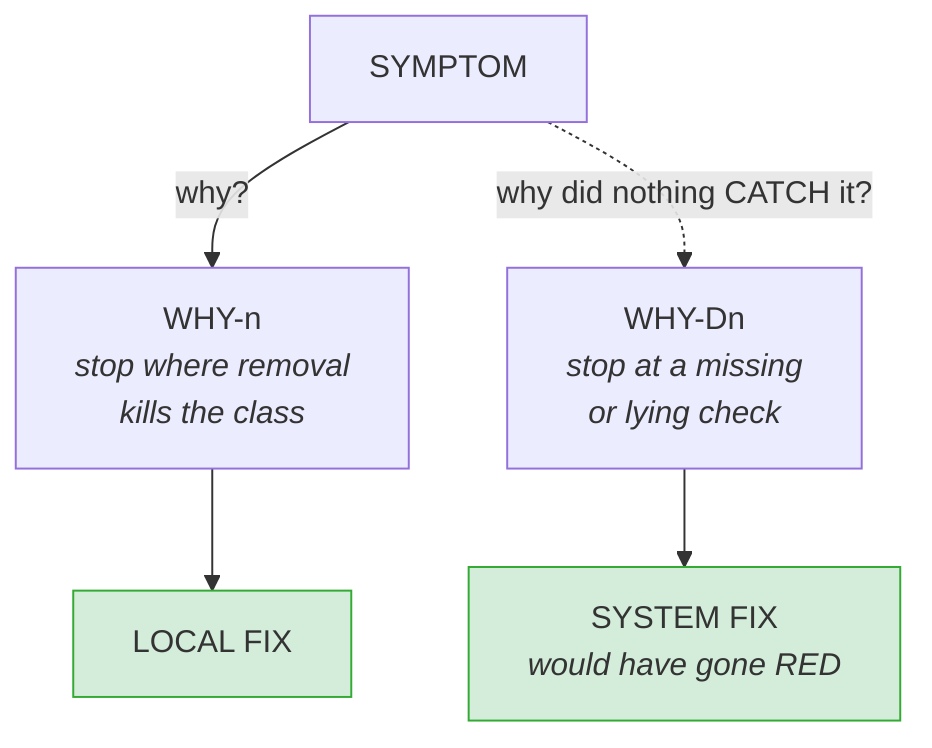
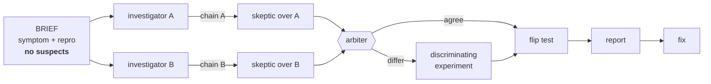

# Five Whys with rival agents

Descend from a symptom to the cause that makes the whole symptom CLASS
impossible - and to the missing check that let it ship. The deliverable is an
artifact anyone can re-run: a chain whose every link cites code or pasted command
output, built by two agents who never saw each other's reasoning, attacked by two
more, and closed by a flip test that makes the symptom appear and disappear on
command.

**The Iron Law: a link without a filled EVIDENCE slot is not a link.** It holds
when the answer is obvious and when the chain is two links long. An analysis
nobody can check is indistinguishable from a guess that happened to be right.

## Two descents, one symptom

Five is a heuristic, not a quota. The causal descent alone explains the instance;
it never explains why the instance shipped, and a fix built from it is regenerated
by the next change. Toyota's own example ends at *"there is no peer-review step in
the deployment process"* - the last link names how the WORK is done, and that is
the detection descent, not the causal one.

Both descents obey the same evidence contract. `"no test covers this"` is proved
by grepping or running the suite and pasting the result, or by mutating the cause
and showing the gate stay green - never asserted.

**Test the boundary with a sibling.** A chain that explains input X but not input
Y of the same class has not reached the root.

## What counts as evidence

| Source | Status |
|---|---|
| Repository source and tests | **EVIDENCE** - `path:LINE` + the quoted lines |
| Output of a command you ran | **EVIDENCE** - the command + its pasted output |
| Docs, ADRs, incident write-ups, READMEs | hypothesis - tells you where to look |
| Code comments, `TODO`, commit messages | hypothesis |
| Memory files, notes, a prior session | hypothesis |
| Your own earlier conclusions | hypothesis |

When a document and the code disagree, the code wins - and the disagreement is
itself a finding worth reporting.

## The run

Investigation runs in **fresh contexts**, never the orchestrator's - it carries
session history and its own hypotheses, exactly what the contract excludes.
**Naming a suspect in the brief buys two agents that confirm you.** Skeptics are
cross-assigned: destruction, not review, and a refutation carries its own
evidence slot.

**One workspace per agent** - a shared build directory manufactures phantom
passes and phantom failures. Foreground commands with a timeout; an agent that
backgrounds work and waits stalls and loses its output. After restoring a
mutation, re-run the baseline and confirm green before trusting the next run.

**Flip test, and it is the verdict:** apply the fix - symptom gone, full suite
green; re-inject the cause alone - symptom returns; restore. Forward verification
alone is what agents produce when left to themselves. Not flippable is a weaker
result, written as `FLIP: not flippable because <reason>`, never omitted.

**The report is a mermaid `flowchart` plus an evidence list keyed to the node
ids.** A chain is a graph; prose makes the reader rebuild the shape by hand. Node
text is the CLAIM, never a label - a node that would fit any investigation is
decoration. A REFUTED node stays in the diagram, coloured red: deleting it hides
what was tried, which is half the result.

**Fix only after the report exists**, and in two parts - LOCAL (removes the
cause) and SYSTEM (the check that goes red when the cause returns, verified by
re-injection). "We will be more careful" is not a system fix.

## Files

| File | Purpose |
|---|---|
| `references/investigator-prompt.md` | dispatch template - builds one chain |
| `references/skeptic-prompt.md` | dispatch template - attacks a rival's chain |
| `references/report-template.md` | the output artifact; its slots are the contract |
| `tests/TESTING.md` | planted-bug fixture, grading suite, what the runs measured |
| `tests/example-report.md` | a real assembled report |
