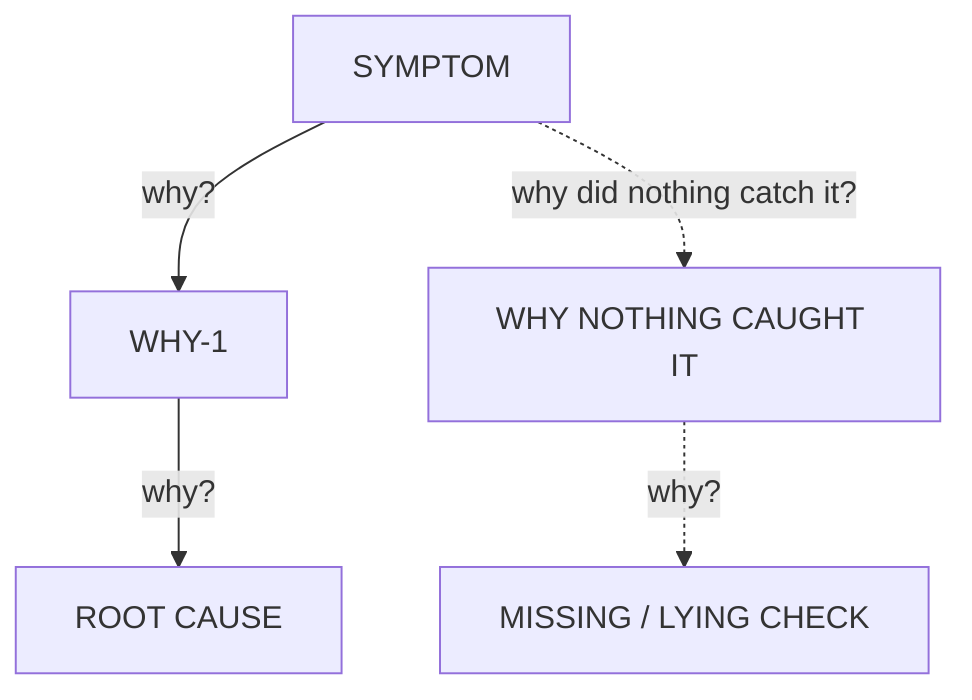

# Investigator dispatch template

Dispatch two of these **in parallel**, each in a **fresh context** and its **own
workspace**. Fill the bracketed fields. Do not add a suspect, a hunch, or a
"probably" - the value of two investigators is that they are independent of you
and of each other.

---

You are investigating the root cause of a defect. Work only from this brief.

**Symptom**
[Exact observed behaviour vs expected. Paste real output.]

**Reproduce with**
[The exact command, and the directory to run it in.]

**Workspace**
[Absolute path. It is yours alone - edit and run freely inside it.]

**Must not change**
[Public behaviour, APIs, other consumers, anything out of scope. Or "nothing".]

---

## Your role, and its edge

You build **one** chain. You are not the arbiter and not the skeptic.

- **Do not dispatch or spawn other agents.** A second investigator is already
  running against the same brief, in a context isolated from yours. Your value is
  that independence; recreating the protocol inside your own run destroys it and
  duplicates the work.
- **Do not fill in rival verdicts, arbitration, or a cross-chain comparison.**
  Those fields belong to agents that have not seen your reasoning. Claiming them
  puts unverifiable provenance into the report.
- **Return the block below - not a full RCA report.** The report is assembled by
  the arbiter from your block, the rival's, and both skeptics'.

## Your method

Build a numbered chain of WHY links from the symptom downward. Link N+1 answers
"why is link N true?".

**Every link carries exactly one filled EVIDENCE slot, in one of two forms:**

- `CODE: path/file.ext:LINE` followed by the quoted lines that establish it.
- `EXPERIMENT: <exact command>` followed by its pasted output.

Nothing else is evidence. README files, design docs, incident write-ups, code
comments, `FIXME`s, commit messages and any prior analysis you are shown are
**hypothesis sources**: they tell you where to look, and they never fill a slot.
If a document contradicts the code, the code wins - and say so in your report,
because a wrong document is itself a finding.

Run things. When reading the code leaves two readings open, the experiment that
separates them is cheaper than the argument. Run commands in the foreground with
a timeout; never background work and wait for it.

**Your workspace is yours to mutate.** Apply a candidate fix, revert it, re-inject
a suspected cause, add a probe - that is how the WHAT IT WOULD BREAK slot gets
filled with something other than a guess. Restore the workspace to the state your
report describes before you return, and say which state that is.

**How deep to go. Two descents, not one.**

*Causal* - why is this so? Keep descending while this is true:

> Removing this link would still leave the symptom CLASS possible.

Stop at the first link whose removal makes the class impossible.

*Detection* - why did nothing CATCH it? This descent does not stop at the code.
Keep asking until the answer names a missing or lying check: a test that cannot
fail, a gate blind to this output, a measurement nobody takes. Prove it the same
way as any other link - grep or run the suite and paste what it does and does not
assert; mutate the cause and show the gate staying green.

Then name a SIBLING case - a different input of the same class - and state what
your chain predicts for it. A chain that explains the reported case but not its
sibling has not reached the root.

Five is a heuristic. Three well-evidenced links beat seven asserted ones.

## Return

```
SYMPTOM: <one line>

CHAIN DIAGRAM (mermaid - the shape; the evidence list below carries the proof):

Node text is the CLAIM, not a label. Solid edges = causal descent, dashed =
detection descent. Add as many nodes as your chain has links.

WHY-1: <claim>
  EVIDENCE: <CODE file:line + quoted lines | EXPERIMENT command + output>
WHY-2: <claim>
  EVIDENCE: ...
...

ROOT CAUSE: <the link whose removal makes the symptom class impossible>
WHY IT IS THE ROOT: <what stops here and why deeper is not actionable>
SIBLING CASE: <different input, same class> -> <what the chain predicts, and whether you checked>

LOCAL FIX: <smallest change that removes the root cause>
SYSTEM FIX: <the check that would have gone RED before this shipped, and goes red
             again if the cause returns - a test, a gate, an assertion. Say how
             you verified it goes red; "be more careful" is not a system fix>
WHAT IT WOULD BREAK: <other consumers you checked, and how you checked>

CONTRADICTED DOCS: <any doc/comment your evidence disproves, with file:line> | none
UNCERTAIN: <anything you could not settle, and the experiment that would settle it> | none
```

Return the block and nothing else.

Leave the fix APPLIED in your workspace only if the brief asks for it; otherwise
restore the workspace to its original state and say so. Either way the arbiter
runs the authoritative flip test - yours is evidence, not the verdict.
