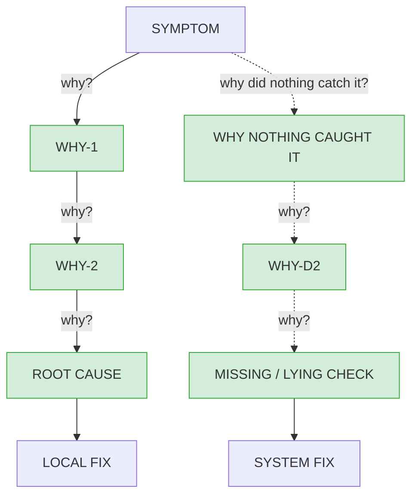
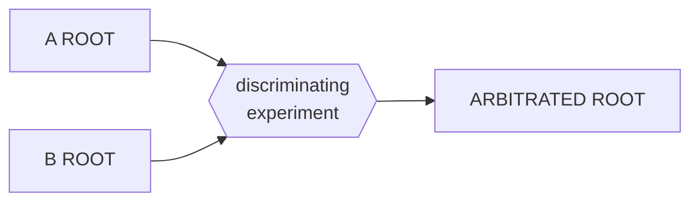

# Report template

The slots are the contract. Fill every one, including in the easy cases - an
empty slot is the finding, not a formatting lapse. Where something genuinely
does not apply, write the reason in the slot; never delete the slot.

---

```markdown
# RCA: <symptom in one line>

## Symptom

OBSERVED: <exact output>
EXPECTED: <exact output>
REPRODUCE: <command> (in <dir>)

## The chain



**The diagram is the chain; the list below is its evidence.** Solid edges are the
causal descent, dashed edges the detection descent. Node colour carries the rival
verdict - green SURVIVES, amber WEAK, red REFUTED. **A refuted node stays in the
diagram**, coloured red: deleting it hides what was tried, which is half the
result.

One node per link, and the node text is the claim - not a label like "the parser".
A diagram whose nodes could belong to any investigation is decoration.

### Evidence, keyed to the nodes

W1: <claim>
  EVIDENCE: <CODE path:line + quoted lines | EXPERIMENT command + pasted output>
  RIVAL VERDICT: SURVIVES | WEAK | REFUTED - <what was tried against it>

W2: <claim>
  EVIDENCE: ...
  RIVAL VERDICT: ...

D1: <claim>
  EVIDENCE: <what the suite/gate does and does not assert - grep or run, pasted>
  RIVAL VERDICT: ...

<... every node in the diagram appears here, including refuted ones>

## Root cause

<the link whose removal makes the symptom CLASS impossible>

WHY IT STOPS HERE: <what removing it makes impossible>
SIBLING CASE: <different input, same class> -> <predicted> -> <observed>

## Why nothing caught it

<the detection descent's last link: the missing or lying check - a test that
 cannot fail, a gate blind to this output, a measurement nobody takes>

EVIDENCE: <what the suite/gate does and does not assert - grep or run, pasted>

## Rival chains



AGREEMENT: converged on the same root by independent evidence
         | diverged - resolved by: <the discriminating experiment and its output>

When the two converged, say so and draw both arrows into the same node; do not
delete the rival, and do not invent a disagreement to fill the diagram.

## Flip test

FIX APPLIED: <the change>
  <command> -> <output: symptom gone, full suite green>
CAUSE RE-INJECTED: <how the cause alone was put back>
  <command> -> <output: symptom returns>
RESTORED: <command> -> <output: green again>

FLIP: PROVED | not flippable because <reason>

## Contradicted documentation

<doc path:line - what it claims, what the evidence shows> | none

## Fix

LOCAL FIX: <the smallest change that removes the root cause>
SYSTEM FIX: <the check that would have gone RED before this shipped>
  WITH CAUSE RE-INJECTED: <command> -> <output: the check FAILS>
  WITH CAUSE REMOVED:     <command> -> <output: the check PASSES>
FULL SUITE: <command> -> <pasted result>
NOT FIXED HERE: <anything the chain surfaced and left open, with why>
```
