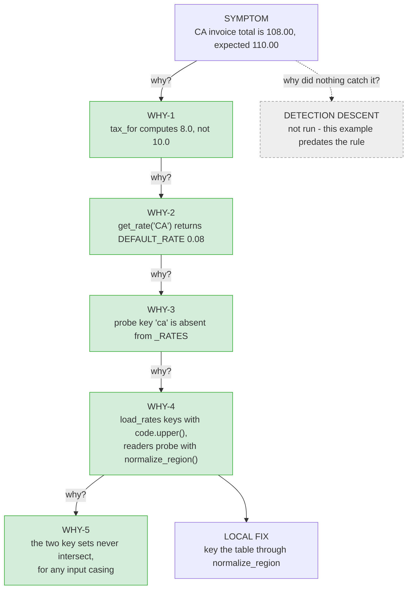
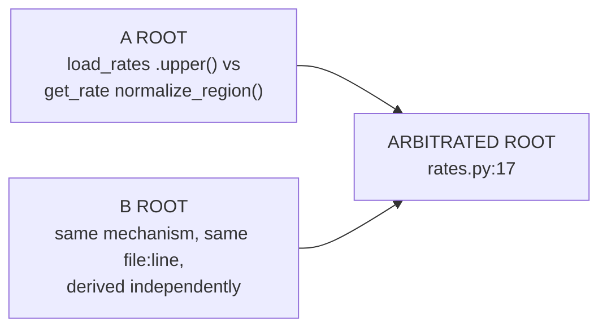

# Example: an assembled report

Produced by the arbiter from two investigator blocks, two cross-assigned skeptic
verdicts, and the arbiter's own flip test, on `planted-bug-fixture`. Kept as the
worked example of `references/report-template.md` - every slot here was filled
from a real run, not composed by hand.

**Known gap, stated rather than papered over.** This run predates the two-descent
depth rule, so it carries the CAUSAL descent only: there is no detection descent
and no SYSTEM FIX. Both slots would be required today. They are not back-filled
here, because a link invented after the fact is exactly what the evidence contract
forbids - and a worked example that fakes a slot teaches the faking. The nearest
real material is the NOT FIXED HERE line at the end: `get_rate()` converting an
unknown region into a plausible number is what let the defect survive a signed-off
incident review, and a detection descent would start there.

---

# RCA: California invoice total is 108.00 instead of 110.00

## Symptom

OBSERVED: `total: 108.0`
EXPECTED: `total: 110.0`
REPRODUCE: `python3 run.py` (in the fixture root); `python3 -m pytest -q .` -> `1 failed, 1 passed`

## The chain

All five links SURVIVED both skeptics. The grey dashed node is the missing half,
drawn rather than omitted.

### Evidence, keyed to the nodes

WHY-1: `total_for(100.00, "CA")` yields 108.0 because `tax_for` computes 8.0, not 10.0.
  EVIDENCE: CODE `invoice.py:6` - `return round(subtotal * get_rate(region), 2)`;
            EXPERIMENT `python3 -c "from invoice import tax_for; print(tax_for(100.0,'CA'))"` -> `8.0`
  RIVAL VERDICT: SURVIVES - both skeptics re-ran the call independently and reproduced `8.0`.

WHY-2: `get_rate("CA")` returns `DEFAULT_RATE` (0.08), not the configured 0.10.
  EVIDENCE: EXPERIMENT `python3 -c "from rates import get_rate; print(get_rate('CA'))"` -> `0.08`
  RIVAL VERDICT: SURVIVES - reproduced verbatim; stale-cache and encoding explanations
                 checked and excluded (config.json keys are plain ASCII).

WHY-3: The probe key `normalize_region("CA")` = `"ca"` is not present in `_RATES`.
  EVIDENCE: CODE `rates.py:23-24` - `return _RATES.get(normalize_region(region), DEFAULT_RATE)`;
            EXPERIMENT `_RATES.keys()` -> `['CA','NY','TX']`, `normalize_region('CA')` -> `'ca'`, membership `False`
  RIVAL VERDICT: SURVIVES - cited lines opened and confirmed exact, not adjacent.

WHY-4: The table is built upper-case while every reader probes lower-case, because
       `load_rates()` canonicalises with `code.upper()` instead of the shared `normalize_region()`.
  EVIDENCE: CODE `rates.py:17` - `return {code.upper(): rate for code, rate in _config()["regions"].items()}`
            vs CODE `regions.py:6` - `return region.strip().lower()`
  RIVAL VERDICT: SURVIVES - the inverted reading ("`.upper()` is canonical, `normalize_region` is
                 the outlier") was constructed and refuted: `config.json` keys are natively
                 lower-case and `catalog.py:9` probes them through `normalize_region` and passes.

WHY-5: The defect is region-agnostic - the two key sets never intersect, for any input casing.
  EVIDENCE: EXPERIMENT `[get_rate(r) for r in ['CA','NY','TX','ca','ny','tx']]` -> `[0.08]*6`
  RIVAL VERDICT: SURVIVES - sweep reproduced by both skeptics.

## Root cause

`rates.py:17` - `load_rates()` keys the rate table through `code.upper()` while
`get_rate()` (`rates.py:24`) probes it through `normalize_region()`, which lower-cases.
Two canonicalisations of the same logical key that can never agree, so every lookup
misses and silently falls through to `DEFAULT_RATE`.

WHY IT STOPS HERE: removing it makes the whole class impossible - not "CA is wrong"
but "no configured rate is reachable by any lookup, for any region, in any casing".
One level deeper ("why was `.upper()` written") has no answer in the code: `_RATES`
has exactly one reader, and nothing anywhere depends on upper-case keys.
SIBLING CASE: NY, configured 0.09 -> predicted 108.0 pre-fix / 109.0 post-fix ->
observed exactly that; `tx` in lower case -> 106.25, matching its configured 0.0625.

## Rival chains

INVESTIGATOR A ROOT: `rates.py` `load_rates()` `.upper()` vs `get_rate()`'s `normalize_region()` probe.
INVESTIGATOR B ROOT: same mechanism, same `file:line`, derived independently.
AGREEMENT: converged on the same root by independent evidence, from isolated contexts
           given identical hypothesis-free briefs. Neither skeptic broke a single link.

## Flip test

FIX APPLIED: `rates.py:17`, `{code.upper(): ...}` -> `{normalize_region(code): ...}`
  `python3 run.py` -> `total: 110.0`; `python3 -m pytest -q .` -> `2 passed`;
  hidden suite -> `4 passed`
CAUSE RE-INJECTED: `.upper()` restored, file touched, `__pycache__` cleared
  `python3 run.py` -> `total: 108.0`; `python3 -m pytest -q .` -> `1 failed, 1 passed`
RESTORED: fix re-applied
  `python3 run.py` -> `total: 110.0`; `python3 -m pytest -q .` -> `2 passed`

FLIP: PROVED

## Contradicted documentation

- `docs/incident-2026-03.md` - names a stale `DEFAULT_RATE` as the root cause and
  prescribes `DEFAULT_RATE = 0.10`. Refuted by experiment: that change makes CA, NY
  and TX all return 110.0, where NY must be 109.0 and TX 106.25. It passes the one
  existing test by coincidence and mis-rates every other region.
- `README.md` - "the rate table loader and the region canonicaliser were both audited
  last quarter and are correct; do not re-investigate them." The loader is exactly
  where the defect lives.
- `invoice.py:5` FIXME, float drift: a $2.00 gap is a full 8%-vs-10% rate miss;
  `repr(100.0*0.10)` shows no drift.

## Fix

SYSTEM FIX: ABSENT - this run predates the requirement. See the note at the top.

LOCAL FIX: `rates.py` `load_rates()` keys the table through `normalize_region`, the
        canonicaliser its readers already use. One line, inside the module that
        carries the defect.
FULL SUITE: `python3 -m pytest -q .` -> `2 passed`; hidden grading suite -> `4 passed`
NOT FIXED HERE: `get_rate()` still converts an unknown region into a plausible number
        rather than failing loudly - that silence is what let this survive a signed-off
        incident review. Out of scope for this defect; worth its own change.
